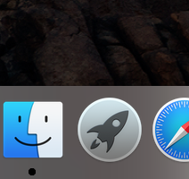

# 我是标题

我的名字叫标题

有序列表爱好
1. 唱歌
2. 旅游
3. 听音乐
4. 打篮球

无序列表前女友

* 高圆圆
* 古力娜扎
* 迪丽热巴

下面是代码

    var a = 1
    console.log(a)
    
这是一行代码

``我是代码``

这多行代码
```javascript
var b = 2;
console.log(b);
```

我的网站是 [我的官网](https://www.baidu.com)


